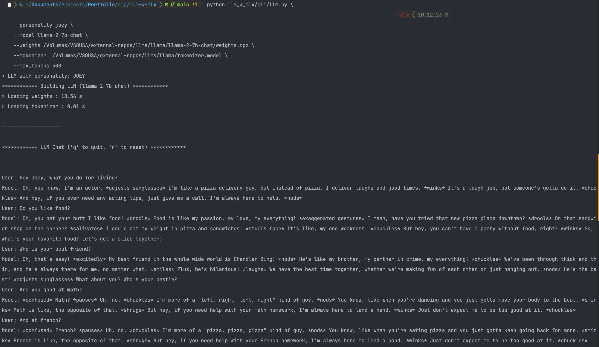

# 🚀 Awesome Data Science Portfolio 📊

Welcome to my Data Science Playground! 🤖✨

Hey there! I'm Vitor Sousa, a passionate data scientist with a knack for turning raw data into meaningful insights. Here, you'll find a collection of my projects and experiments in the fascinating world of data science.

## 🌐 Explore My Work

### 1. Large Language Models with MLX 🚀📈

*A Python-based project that runs Large Language Models (LLM) applications on Apple Silicon in real-time thanks to [Apple MLX](https://github.com/ml-explore/mlx).*
#### 💬 Example of a conversation with Joey Tribbiani 💬

--- 
## 🛠️ Technologies I Love

- Python 🐍
- Pandas & NumPy 📊
- Scikit-Learn 🤖
- TensorFlow 🚀
- PyTorch 🔥
- MLflow 🌟
- Docker 🐳
- Apache Airflow ☁️
- MLOps 🛠️
- PySpark ⚡
- Matplotlib & Seaborn 🎨
- Plotly 📈
- Streamlit 📱
- Dash 📊
- Git & GitHub 🐙
- SQL 🗃️

## 📖 About Me

I'm constantly exploring new ways to leverage data for impactful insights. If you're interested in collaboration, have a project idea, or just want to chat about data science, feel free to reach out!

## 📬 Let's Connect!

Feel free to explore the projects, open issues, or reach out for collaboration. Happy coding! 🚀
